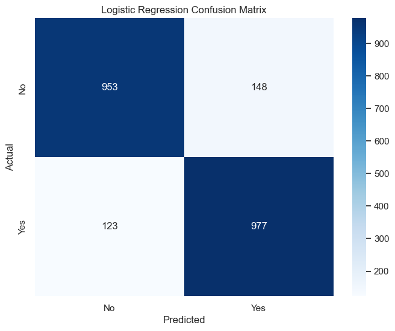

# [UC-Berkeley-ML-AI - Practical Assignment 3](https://dcnguyen060899.github.io/UC-Berkeley-ML-AI-Capstone_Work_Sample/)

## Overview
This project aims to build and evaluate predictive models for a marketing campaign to optimize customer subscriptions for long-term deposit products. It involves data preprocessing, exploratory data analysis (EDA), model training, and evaluation.

## Data Description
The dataset includes both numerical and categorical features relevant to customer behavior.

### Numerical Features
- **age**: Age of the customer
- **duration**: Last contact duration in seconds
- **campaign**: Number of contacts performed during this campaign
- **pdays**: Number of days since the client was last contacted
- **previous**: Number of contacts performed before this campaign
- **emp.var.rate**: Employment variation rate
- **cons.price.idx**: Consumer price index
- **cons.conf.idx**: Consumer confidence index
- **euribor3m**: Euribor 3-month rate
- **nr.employed**: Number of employees

### Categorical Features
- **job**: Type of job
- **marital**: Marital status
- **education**: Education level
- **default**: Has credit in default?
- **housing**: Has housing loan?
- **loan**: Has personal loan?
- **contact**: Type of communication contact
- **month**: Last contact month
- **day_of_week**: Last contact day of the week
- **poutcome**: Outcome of the previous marketing campaign

## Exploratory Data Analysis (EDA)
### Key Visualizations
1. **Age Distribution**:
   
   - Most customers are around 30 years old.
   - The age distribution shows a right skew, indicating fewer older customers.

2. **Call Duration Distribution**:
   
   - Majority of calls are short, typically under 500 seconds.
   - The distribution is heavily right-skewed, with a long tail of longer calls.

3. **Correlation Matrix**:
   
   - Highlights positive and negative relationships between numerical features.
   - `duration` and `y_encoded` have a moderate positive correlation, suggesting longer calls are associated with higher subscription rates. (Note that y_encoded is the subscription rate)

4. **Education vs Subscription**:
   
   - Higher subscription rates are observed among customers with university degrees.
   - Customers with lower educational levels tend to have lower subscription rates.

5. **Job vs Subscription**:
   
   - Job types like 'admin.' and 'blue-collar' have lower subscription rates.
   - Higher subscription rates are observed for job types like 'management' and 'retired'.

6. **Subscription Distribution**:
   
   - Majority of the customers did not subscribe.
   - There is a significant class imbalance with far fewer subscribers.

7. **Contact Communication Type vs Subscription**:
   
   - Higher subscription rates are seen for cellular contacts compared to telephone.
   - The majority of contacts were made via cellular phones.

8. **Housing Loan vs Subscription**:
   
   - Customers without housing loans have higher subscription rates.
   - Most customers, irrespective of subscription status, do have housing loans.

9. **Marital Status vs Subscription**:
   
   - Single customers have higher subscription rates compared to married or divorced ones.
   - Married customers form the largest group but have lower subscription rates.

10. **Personal Loan vs Subscription**:
    
    - Higher subscription rates are observed for customers without personal loans.
    - Most customers, especially those who did not subscribe, do not have personal loans.

## Model Comparison and Observing Overfitting
Four models were evaluated: Logistic Regression, Decision Tree, K-Nearest Neighbors (KNN), and Support Vector Machine (SVM).

| Model                 | Train Time (seconds) | Train Accuracy | Test Accuracy | CV Mean Accuracy | CV Std Dev |
|-----------------------|----------------------|----------------|---------------|------------------|------------|
| Logistic Regression   | 81.01                | 0.878          | 0.877         | 0.874            | 0.009      |
| Decision Tree         | 2.32                 | 0.991          | 0.960         | 0.944            | 0.002      |
| K-Nearest Neighbors   | 4.75                 | 1.000          | 0.909         | 0.913            | 0.008      |
| Support Vector Machine| 875.95               | 1.000          | 0.996         | 0.992            | 0.002      |

### Visualizations
- **Cross-Validation Mean Accuracy Comparison**
  
- **Test Accuracy Comparison**
  
- **Training Accuracy Comparison**
  
- **Training Time Comparison**
  

### Observations
- SVM shows the highest accuracy but requires more training time.
- Logistic Regression and Decision Tree models have strong performance with faster training times.
- KNN and Decision Tree model indicates potential overfitting.

The Support Vector Machine (SVM) is the best choice for optimizing marketing campaigns due to its superior predictive performance and ability to generalize well on new data, despite its higher computational cost.

### Classification Performance and Confusion Matrix Analysis

#### Logistic Regression
- **Training Time**: 81.01 seconds
- **Confusion Matrix**:
  
- **Classification Report**:

| Metric    | Precision (No) | Precision (Yes) | Recall (No) | Recall (Yes) | F1-score (No) | F1-score (Yes) | Accuracy | ROC-AUC   |
|-----------|----------------|-----------------|-------------|--------------|---------------|----------------|----------|-----------|
| Values    | 0.89           | 0.87            | 0.87        | 0.89         | 0.88          | 0.88           | 0.88     | 0.9386    |

  
  

#### Decision Tree
- **Training Time**: 2.32 seconds
- **Confusion Matrix**:
  
- **Classification Report**:

| Metric    | Precision (No) | Precision (Yes) | Recall (No) | Recall (Yes) | F1-score (No) | F1-score (Yes) | Accuracy | ROC-AUC   |
|-----------|----------------|-----------------|-------------|--------------|---------------|----------------|----------|-----------|
| Values    | 0.99           | 0.93            | 0.93        | 0.99         | 0.96          | 0.96           | 0.96     | 0.9674    |

  
  

#### K-Nearest Neighbors (KNN)
- **Training Time**: 4.75 seconds
- **Confusion Matrix**:
  
- **Classification Report**:

| Metric    | Precision (No) | Precision (Yes) | Recall (No) | Recall (Yes) | F1-score (No) | F1-score (Yes) | Accuracy | ROC-AUC   |
|-----------|----------------|-----------------|-------------|--------------|---------------|----------------|----------|-----------|
| Values    | 1.00           | 0.85            | 0.82        | 1.00         | 0.90          | 0.92           | 0.91     | 0.9913    |

  
  

#### Support Vector Machine (SVM)
- **Training Time**: 875.95 seconds
- **Confusion Matrix**:
  
- **Classification Report**:

| Metric    | Precision (No) | Precision (Yes) | Recall (No) | Recall (Yes) | F1-score (No) | F1-score (Yes) | Accuracy | ROC-AUC   |
|-----------|----------------|-----------------|-------------|--------------|---------------|----------------|----------|-----------|
| Values    | 0.99           | 1.00            | 1.00        | 0.99         | 1.00          | 1.00           | 1.00     | 0.9998    |

  
  

The SVM model achieved the highest accuracy and AUC but required the longest training time. The Decision Tree and KNN models also performed well, with the Decision Tree showing strong accuracy and KNN demonstrating high recall for the positive class. Logistic Regression, while slightly lower in performance, remains a robust and interpretable model.

## Feature Importance Analysis
Permutation feature importance was analyzed for SVM and Logistic Regression models due to the lack of overfitting evidence.

### SVM Feature Importance
Top features:
- `num_emp.var.rate`
- `num_duration`
- `num_cons.price.idx`
- `num_nr.employed`
- `num_euribor3m`

### Logistic Regression Feature Importance
Top features:
- `num_nr.employed`
- `num_cons.conf.idx`
- `num_cons.price.idx`
- `num_euribor3m`
- `num_emp.var.rate`

## Partial Dependence Plots (PDPs)
PDPs help understand the relationship between features and the target variable.

### Key Insights
1. **Call Duration**: Moderate durations (6-8 minutes) increase subscription likelihood.
2. **Number of Contacts During Campaign**: Fewer contacts are better.
3. **Days Since Last Contact**: More days since the last contact increases likelihood.
4. **Number of Previous Contacts**: Fewer previous contacts are better.
5. **Employment Variation Rate**: Lower rates are better.
6. **Consumer Price Index**: Moderate values are better.
7. **Consumer Confidence Index**: Moderate values are better.
8. **Month of Contact**: Specific months like March, June, September, and December might be less favorable.

### Business Implications
1. **Optimal Call Duration**: Maintain calls between 6 and 8 minutes.
2. **Contact Frequency**: Reduce the number of campaign contacts.
3. **Re-contact Timing**: Allow more days between contacts.
4. **Previous Contacts**: Minimize to avoid contact fatigue.
5. **Economic Indicators**: Monitor to identify favorable conditions.
6. **Month of Contact**: Adjust timing strategies based on further data validation.

### Comparison with the Paper Findings
- **Model Performance**:
  - Both my findings and the paper highlight SVM as the best performer.
- **Key Features**:
  - Both analyses emphasize the importance of call duration and month of contact.
- **Insights**:
  - Align on the effectiveness of fewer contacts and strategic timing for higher subscription rates.

### Recommendations Moving Forward

1. **Enhanced Feature Engineering**:
   - **Interaction Features**: Develop interaction terms between important features, such as `num_duration` and `num_previous`.
   - **Temporal Features**: Create features like recency of contact (`recent_contact` if `num_pdays` < 7).
   - **Aggregate Features**: Calculate mean/median call duration for each customer.
   - **Binning Features**: Bin continuous variables like call duration into categories (e.g., short, medium, long).
   - **Lag Features**: Generate lag features for temporal data, like the difference in days between consecutive contacts.
   - **Encoding Categorical Variables**: Use frequency encoding for categorical variables to retain distribution information.
   - **Macro-Economic Trends**: Create moving averages for economic indicators like `num_emp.var.rate`.

2. **Model Improvement**:
   - **Ensemble Methods**: Combine models using techniques like Random Forest, XGBoost, Gradient Boosting or possibly neural network to capture its hidden complexity.

3. **Business Strategy Optimization**:
   - **Call Duration Management**: Focus on maintaining call durations within the optimal range of 6-8 minutes to maximize subscription likelihood.
   - **Contact Frequency Reduction**: Reduce the number of campaign contacts to avoid customer annoyance and improve effectiveness.
   - **Strategic Re-Contact Timing**: Plan re-contacts after optimal periods (e.g., 20-30 days) and focus on months that show higher success rates based on historical data.

By implementing these recommendations, the marketing campaigns can become more efficient, targeted, and effective, leading to higher subscription rates and better resource management.

## Conclusion
The SVM model is recommended for its superior performance and actionable insights. The use of permutation importance and PDPs enhances the model's interpretability, guiding strategic decisions for optimizing marketing campaigns. Further feature engineering can improve model performance and provide deeper insights into customer behavior.
